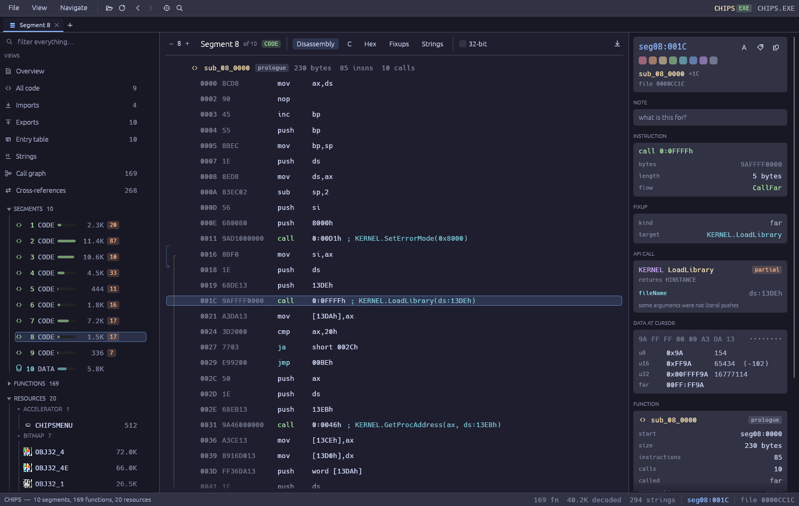
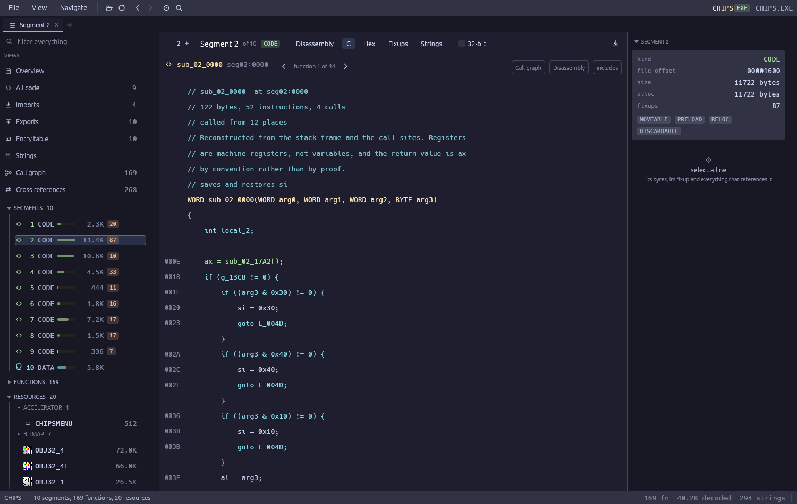
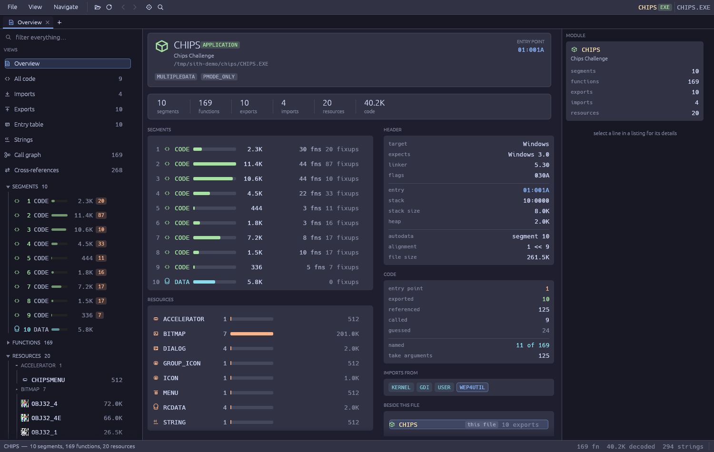
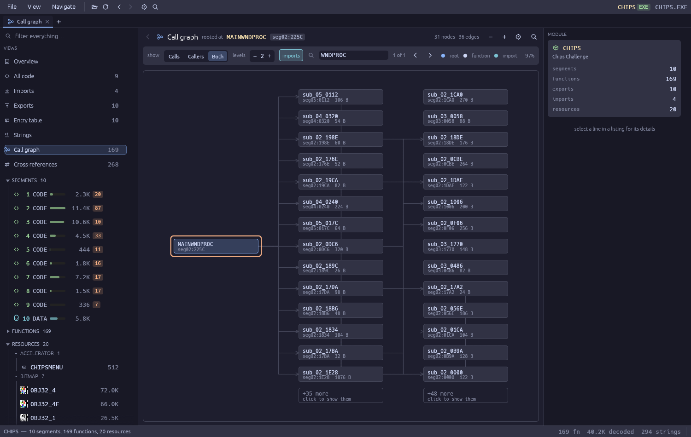
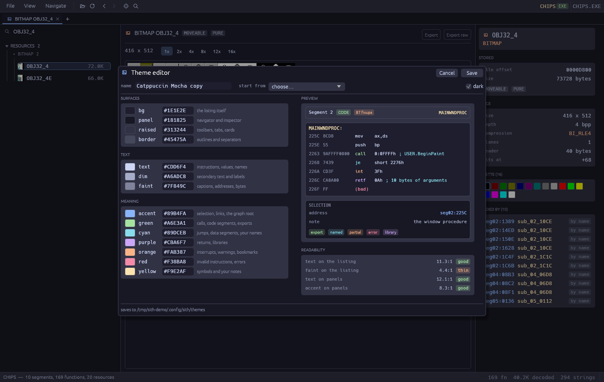
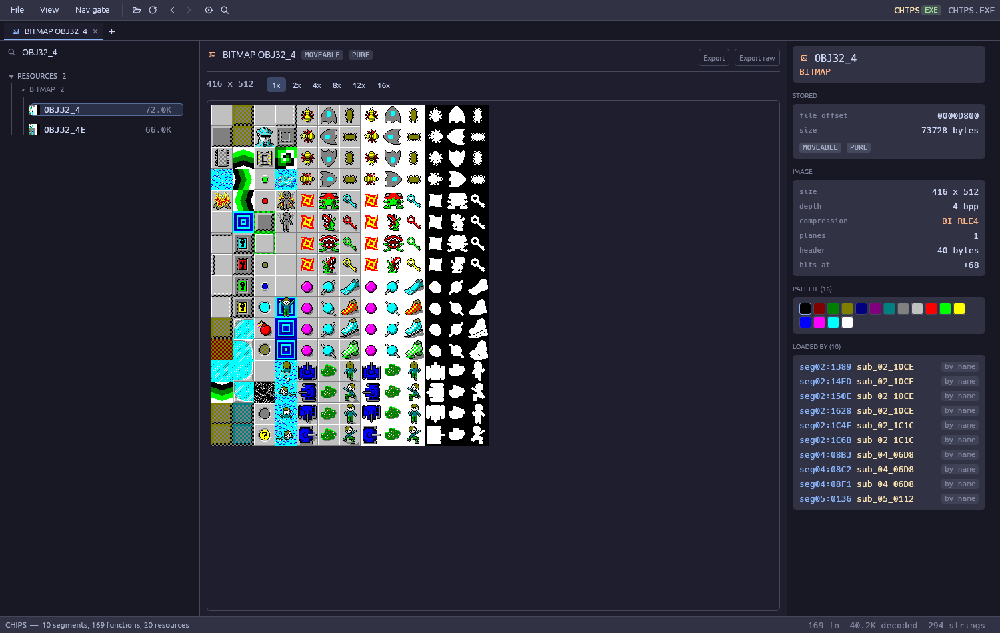

# sith

A reverse-engineering toolkit for 16-bit Windows NE (New Executable) binaries —
the `.EXE`, `.DLL` and `.DRV` files that Windows 3.x ran. It is a Rust
workspace: a parsing library, a fixup-aware disassembler, an analysis pass, a
command-line tool, and a GUI browser.

It is not tied to any one project. Point it at any NE binary.



## Why

NE binaries have a trap in them. Relocations are stored as *chains threaded
through the code itself*: the operand bytes of an unfixed far call hold the
offset of the next fixup site, not the address of the callee. Disassemble the
raw bytes and you get output that is confident and wrong — every intersegment
call points somewhere plausible and false.

`sith` walks the chains, resolves each patch site, and names the target. On top
of that it knows the Win16 API: 3,231 ordinal names and 1,922 signatures
generated from Wine's 16-bit `.spec` files, plus a curated table of parameter
constants. So a call site reads

```
0707  9A5F070000   call 0:075Fh  ; USER.LoadCursor(0, IDC_ARROW)
0711  9AFFFF0000   call 0:0FFFFh  ; GDI.GetStockObject(BLACK_BRUSH)
0121  9A4F010000   call 0:014Fh  ; GDI.BitBlt(word [1734h], word [bp-0Ah], …, SRCCOPY)
```

instead of `call 0:0FFFFh`.

## Reading the code as C

Every listing has a **C** tab. It is not a decompiler: each line still
corresponds to one instruction and registers stay registers. What it does is
spend what the tool already knows — the stack frame, the call sites, the
imported signatures — on making the listing read as statements.



Forward conditionals that skip a region become `if` blocks, an unconditional
jump at the end of one becomes its `else`, and a backward conditional becomes
`do … while`. A region only becomes a block when nothing outside it branches
into its middle: a block with two entrances is not a block, and writing one as
if it were would be the first place this view lied. Everything that fails that
test keeps its `goto`, which is ugly and correct.

The idioms a 16-bit compiler leans on are read as what they mean rather than
what they are. `xor ax,ax` is zero. `or ax,ax` is a test against zero, not a
bitwise or. `sbb r,r` / `inc r` is a comparison being stored, so it folds back
into the comparison. A chain of `sub ax,n` / `je` is a switch, so the flags an
arithmetic instruction leaves are tracked to the branch that reads them.

Frame setup and teardown are dropped, because the signature and the local
declarations above already say what they say. They are matched as runs from
each end of the function rather than by pattern anywhere in it: `mov ds,ax` on
the way in is the Win16 data-segment reload, and the same instruction two
hundred bytes later is the program doing something.

It also writes the header a function would need, from the import table and the
call sites:

```c
#include <windows.h>

// from KERNEL
extern FARPROC   FAR PASCAL GetProcAddress(WORD hModule, LPCSTR procName);
extern HINSTANCE FAR PASCAL LoadLibrary(LPCSTR fileName);
extern UINT      FAR PASCAL SetErrorMode(WORD mode);

// in this module
static WORD sub_02_17A2(void);

// module data, named by where it sits
static WORD g_13C8;
```

The widths are real. The types are not: a `WORD` here may have been an `HWND`
or a `BOOL`, and only the header this stands in for could say which. A DLL
belonging to the program has no SDK header at all, and the view says so rather
than naming a file that was never shipped.

Nothing is invented anywhere in this view. A value computed rather than pushed
is left as the register holding it, an argument the reconstruction could not
recover is marked, a jump out of the function is shown as an address rather
than a label that does not exist, and an instruction with no C shape is emitted
verbatim inside `__asm` and colored so it stands out.

## Install

```sh
cargo build --release
# binaries land in target/release/{sith,sith-gui}
```

Linux, macOS and Windows. Configuration goes wherever the platform keeps it:
`~/.config/sith` (honouring `XDG_CONFIG_HOME`), `~/Library/Application
Support/sith`, or `%APPDATA%\sith`.

## Command line

```sh
sith info      FILE                  header, segments, imports, exports, resources
sith segments  FILE
sith imports   FILE                  imported symbols per module, with usage counts
sith exports   FILE
sith entries   FILE                  the entry table, exported or not
sith relocs    FILE [-s N] [--sites] fixups, collapsed by target or per patch site
sith dis       FILE -s N             disassemble, with fixups and API calls resolved
sith pseudo    FILE -s N [-f OFF]    render a function as C-shaped statements
sith funcs     FILE [-s N]           discovered functions and the evidence for each
sith callgraph FILE [-s N]
sith xref      FILE NAME             call sites of a symbol
sith strings   FILE [-s N]
sith hex       FILE [-s N] [-o OFF]
sith res       list|show|extract FILE
sith extract   FILE OUTDIR           every segment and resource as a usable file
sith scan      DIR                   summarise every NE binary under a directory
sith ordinals  [MODULE] [ORDINAL]    query the built-in Win16 API table
```

Useful flags: `--json` on the informational commands, `--index DIR` to resolve
ordinal imports of sibling DLLs, `--ordinals FILE` to override names,
`--color auto|always|never`.

Disassembly options: `--start`/`--end` to bound the range, `-f OFFSET` for a
single function, `--bits32` for segments that promote themselves through DPMI,
`--syntax nasm|intel|masm`.

## GUI

```sh
sith-gui [FILE|PROJECT]
```

- Tabbed views over a workspace of files, with back/forward history. Clicking
  an imported symbol opens the DLL that exports it, at the export.
- A navigator with segments, functions grouped by segment, resources with live
  thumbnails, and every sibling module found beside the file. A function opens
  to the arguments it takes: where each one sits, how wide it is, and whether
  the body ever reads it.
- A disassembly listing with an interactive branch-arrow gutter — hover an arc
  to light up the whole path and both ends, click to follow it — plus function
  banners, resolved fixups and reconstructed API calls.
- A **C** tab on every listing, and an **All code** view that puts every code
  segment in one listing when you want to read the program end to end.
- An inspector showing the selected instruction's bytes, its fixup, the API
  signature with named arguments, everything that references it, and the box
  where you name it and write your note.
- A call-graph explorer: pan and zoom, callers and callees, drag nodes where
  you want them, color and name them, click to re-centre, and search by name
  or address with every match ringed.
- A strings browser that cross-references each string to the code that loads
  it, and a string table that shows which `LoadString` call asks for each
  entry.
- Resource preview for bitmaps, icons and cursors, with export to real `.bmp`,
  `.ico` and `.cur` files; menus, dialogs, string tables, accelerators and
  version info decode to text.
- A command palette over everything in the binary, with scoped search and match
  highlighting.
- Seven built-in themes — Catppuccin Mocha, Macchiato and Latte, Nord, Tokyo
  Night, Gruvbox Dark and Midnight — under View ▸ Theme, remembered between
  runs, plus an editor for making your own.



### The call graph



One node per function, not one per path to it: a breadth-first walk records
each function at its shortest distance from the root and never adds it again,
so a helper reachable four ways appears once with four edges into it rather
than four times in four columns. Nodes drag where you put them and stay there
across a re-layout; a color or a name you give one follows it everywhere.

### Themes

A theme is fourteen named roles, and every view names a role rather than a
color, so a new palette changes the look without changing what anything means.
View ▸ Theme ▸ Edit this theme opens an editor with a swatch and an editable
hex field per role; changes apply to the running window as you make them,
because a palette is judged by how a listing reads under it rather than by how
the swatches look beside each other.

Saving writes a small JSON file to the `themes/` directory beside the config,
which can be hand-written, copied between machines or checked in:

```json
{
  "name": "My theme",
  "dark": true,
  "bg": "#1E1E2E",
  "panel": "#181825",
  "raised": "#313244",
  "border": "#45475A",
  "text": "#CDD6F4",
  "dim": "#A6ADC8",
  "faint": "#7F849C",
  "accent": "#89B4FA",
  "green": "#A6E3A1",
  "cyan": "#89DCEB",
  "purple": "#CBA6F7",
  "orange": "#FAB387",
  "red": "#F38BA8",
  "yellow": "#F9E2AF"
}
```



The editor checks contrast as you go. A tool whose job is dense text has to say
when a palette fails at it, because a palette that looks pleasant as a row of
swatches can be unreadable as a listing.

Editing a built-in starts a copy rather than overwriting it, and a saved theme
that shares a built-in's name replaces it in the list, which is how to adjust
one of the shipped palettes without losing the original.

### Keys

`Ctrl+O` open, `Ctrl+S` save project, `Ctrl+P` find anything, `Ctrl+G` go to an
address or symbol, `Ctrl+W` close tab, `Alt+←`/`Alt+→` history, `Ctrl+1`/`Ctrl+2`
show or hide the side panels, `↑`/`↓` move, `Enter` follow, `N` name the
selected address, `B` bookmark it. On macOS `Ctrl` reads as `Cmd`.

All of them are rebindable under View ▸ Key bindings. Click a shortcut, press
the key you want. A key another command already holds is refused rather than
taken, because silently unbinding the other one takes away a shortcut you never
touched. Only what you changed is written to `keys.json`, so a default that
improves later still reaches you.

### The command palette

`Ctrl+P` searches functions, segments, resources, imports, strings, sibling
modules and the tool's own commands at once. A leading sigil narrows it:

| prefix | searches |
| --- | --- |
| `>` | commands |
| `@` | functions |
| `#` | strings |
| `$` | resources |
| `seg02:1A40` | an address, offered directly |

Matching is subsequence-based and ranked, so `mwp` finds `MAINWNDPROC`, and the
matched letters are marked in the result so it is clear why an entry is there.

## Projects

Everything the tool derives from a binary can be recomputed at any time. What
cannot is the part that came out of your head. A project file holds exactly
that, keyed by address:

- the names you gave to addresses,
- the notes you attached to them,
- your bookmarks,
- which segments you decided hold 32-bit code.

`File ▸ New project…` opens a three-step wizard: point it at the folder the
program was installed to, tick the modules worth keeping, name the result. The
scan finds the NE binaries among the data files and reports what each one holds
— segments, exports, resources — so the choice can be made without opening any
of them.

`File ▸ Save project` writes a `.sith` file; `Ctrl+S` saves again, and every
later change is written back automatically so nothing is lost to a crash.
Opening a project reopens every binary it refers to, and `sith-gui FILE.sith`
opens one straight from the command line.

The format is JSON, so it diffs, merges and reads as plain text:

```json
{
  "format_version": 1,
  "name": "chips",
  "binaries": [
    {
      "path": "CHIPS.EXE",
      "module": "CHIPS",
      "bits32": [],
      "names": { "02:225C": "MainWndProc" },
      "comments": { "02:225C": "handles WM_PAINT" },
      "bookmarks": ["02:225C"]
    }
  ]
}
```

Binary paths are stored relative to the project file where possible, so a
project folder can be moved, shared or checked in as a unit; a binary that has
moved is still matched by its module name.

## Crates

| crate | what it is |
| --- | --- |
| `ne-core` | NE container parsing: header, segments, relocation chains, entry table, names, resources, DIB decoding, the Win16 ordinal and API databases |
| `ne-disasm` | `iced-x86` decoding with each instruction annotated by the fixup covering its operand bytes |
| `ne-analysis` | function discovery, call graph, cross-references, data references, call-site argument reconstruction, stack-frame signatures, the C rendering |
| `sith` | the command-line tool |
| `sith-gui` | the `egui` browser |

## What it knows about the format

Header and program flags, self-loading modules, the segment table with its
alignment shift, all six relocation address types and all four target types,
additive fixups, movable and fixed entry-table bundles, resident and
non-resident name tables, and the resource tree.

Resources decode rather than merely dump: `RT_BITMAP` to `.bmp`, `RT_ICON` and
`RT_CURSOR` (including group directories) to `.ico` and `.cur`, DIBs at 1, 4, 8,
16, 24 and 32 bpp including `BI_RLE4` and `BI_RLE8`, string tables, menus,
dialog templates, accelerator tables and `VS_VERSIONINFO` in its 16-bit ANSI
form.

Bitmap fonts are decoded too, so a `.FON` — an NE library whose only payload is
`RT_FONTDIR` and `RT_FONT` — opens like anything else and previews as a sheet
of its glyphs. Glyph bitmaps are stored *column major*, which is the detail
that turns a naive reader's output into a sheared mess.

### Resources and the code that loads them



A resource is inert until something asks for it, and the ask is always the same
shape: a `LoadBitmap`, `DialogBox` or `LoadString` call naming it. Both idioms
are recovered — an id pushed as a literal, and a far pointer to a string whose
text matches a named resource — so a bitmap says which function draws it and a
loading call links straight to the artwork:

```
sith res list CHIPS.EXE
  type            id                  offset     size  refs  loaded by
  BITMAP          OBJ32_4             0000D800    73728    10  by name  seg02:1389 seg02:14ED …
  MENU            CHIPSMENU           0003FC00      512     2  by name  seg02:090A seg02:22C1
  DIALOG          DLG_GOTO            0003FE00      512     1  by name  seg02:20EA
```

## Where the API data comes from

`tools/fetch_ordinals.py` regenerates `crates/ne-core/data/win16_ordinals.json`
and `win16_api.json` from Wine's 16-bit `.spec` files, which are authoritative.
Hand-written tables in circulation get this wrong — one common table has GDI.27
as `BitBlt` when it is `Rectangle`, and GDI.34, the real `BitBlt`, as
`CreateBrushIndirect`.

Two files are curated by hand, because no machine-readable source carries what
is in them:

- `win16_constants.json` binds named flag and enumeration sets (`GMEM_*`,
  `MB_*`, `WS_*`, ROP codes, `IDC_*`, `DISPLAYDIB_*`, `MMIO_*`, WinG dither
  modes, …) to specific parameters of specific functions.
- `win16_params.json` gives return types and parameter names for the entry
  points that turn up most in application code, including the modules a game
  actually leans on: WinG, DISPDIB, MMSYSTEM's `mmio`/`wave`/`time`/`mci`
  families, SHELL, TOOLHELP, VER, LZEXPAND and COMMDLG.

A names list whose length no longer matches the argument list is dropped rather
than applied: a wrong parameter name is worse than none.

## Accuracy notes

Two things in here are heuristics, and both say so where they are shown:

- **Recovered intersegment offsets.** An `ADDR_SEGMENT` fixup patching a bare
  `mov ax, seg X` has no offset word to read. Where an offset cannot be
  recovered and validated against the target segment's size, the target renders
  as `segNN:????` rather than as a plausible guess.
- **String and argument references.** 16-bit code loads a data pointer as a
  bare immediate, so tying a string to its code, or an argument to its value,
  is pattern matching rather than proof. Arguments that were not literal pushes
  are shown as their operand text, and partial reconstructions are marked.
- **Reconstructed signatures.** How many bytes a function takes comes from its
  `retf n`, which is the compiler stating it. What those bytes *are* does not:
  slots are words unless the code proves otherwise by loading four bytes into
  a segment register, and an argument the body never reads is marked as such
  rather than dropped. A function with no stated frame falls back to how far
  its `[bp+n]` reads reached, which is a floor and not a count.

## Tests

```sh
cargo test
```

The parser is exercised against a hand-assembled NE image built byte by byte in
the test, so a failure names the field that moved. The DIB decoder was
validated pixel-for-pixel against ImageMagick on RLE4, RLE8 and uncompressed
resources. The control-flow structuring is tested against synthetic bodies,
including the case it must refuse: a region something else jumps into cannot
become a block.

## License

MIT. See [LICENSE](LICENSE).
